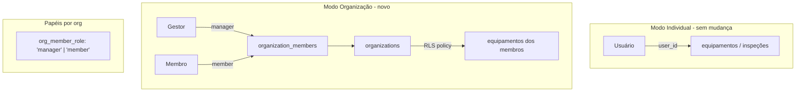

# Plano: Multi-Tenancy Opcional com Painel de Gestor

## Visão geral da arquitetura



> O isolamento por `user_id` existente não muda. O multi-tenant é uma camada adicional via `organization_members`.

---

## Fase 1 — Banco de dados (1 nova migration Supabase)

**Arquivo:** `supabase/migrations/YYYYMMDD_multi_tenant.sql`

### Novas tabelas

- **`organizations`**
  - `id uuid PK`, `name text`, `slug text UNIQUE`, `created_by uuid FK auth.users`, `is_active bool`, `created_at`, `settings jsonb`

- **`organization_members`**
  - `id uuid PK`, `organization_id uuid FK organizations`, `user_id uuid FK auth.users`, `role org_member_role` (enum `'manager' | 'member'`), `invited_by uuid`, `status text` (`'pending' | 'active'`), `joined_at`

### RLS

- `organizations`: CRUD apenas para membros e gestores da própria org
- `organization_members`: gestor pode inserir/remover; membro vê apenas própria linha
- Todas as tabelas de equipamento/inspeção (~15 tabelas): **adicionar nova policy** que permite SELECT quando:
  ```sql
  user_id = auth.uid()                          -- acesso próprio existente
  OR EXISTS (
    SELECT 1 FROM organization_members om_manager
    JOIN organization_members om_target
      ON om_manager.organization_id = om_target.organization_id
    WHERE om_manager.user_id = auth.uid()
      AND om_manager.role = 'manager'
      AND om_target.user_id = <tabela>.user_id
  )
  ```

### RPCs (SECURITY DEFINER)

- `create_organization(name, slug)` — cria org e insere criador como gestor
- `invite_member(org_id, email)` — cria entrada `pending` em `organization_members`
- `accept_invite(org_id)` — muda status para `active`
- `remove_member(org_id, user_id)` — apenas gestor
- `get_org_members(org_id)` — retorna perfis + role dos membros
- `get_org_dashboard_stats(org_id)` — contagens de equipamentos, inspeções pendentes, membros

---

## Fase 2 — Tipos e contexto

### [`src/types/supabase.ts`](src/types/supabase.ts)
Adicionar manualmente (ou regenerar) as novas tabelas `organizations` e `organization_members` ao tipo `Database`.

### Novo arquivo: `src/contexts/TenantContext.tsx`
Expõe:
```ts
interface TenantContextValue {
  userOrganizations: Organization[]
  currentOrg: Organization | null
  orgRole: 'manager' | 'member' | null
  switchOrganization: (orgId: string) => void
  createOrganization: (name: string) => Promise<void>
  refreshOrgs: () => Promise<void>
}
```
Carrega `organization_members` do usuário logado ao montar; persiste `currentOrgId` em `localStorage`.

### [`src/main.tsx`](src/main.tsx)
Envolver app com `<TenantProvider>` (dentro de `<AuthProvider>`).

### Novo arquivo: `src/utils/tenantOperations.ts`
Funções para operações de gestor: `fetchOrgMembers`, `inviteMember`, `removeMember`, `fetchOrgEquipment`, `fetchOrgStats`.

---

## Fase 3 — Guards e rotas

### Novo arquivo: `src/components/TenantManagerRoute.tsx`
Semelhante ao `AdminRoute` existente — redireciona se `orgRole !== 'manager'`.

### [`src/App.tsx`](src/App.tsx)
Adicionar novas rotas protegidas por `TenantManagerRoute`:
```
/tenant/dashboard      → TenantDashboardPage
/tenant/members        → TenantMembersPage
/tenant/equipment      → TenantEquipmentPage
```
E rota para usuário comum aceitar convite:
```
/join/:orgId           → JoinOrganizationPage  (ProtectedRoute)
```

---

## Fase 4 — Novas páginas

### `src/pages/tenant/TenantDashboardPage.tsx`
- Cabeçalho com nome da org + badge "Gestor"
- Cards: total de membros, equipamentos cadastrados, inspeções pendentes/vencidas
- Chama RPC `get_org_dashboard_stats`

### `src/pages/tenant/TenantMembersPage.tsx`
- Lista de membros com nome, email, status e role
- Botão "Convidar membro" (abre modal com input de email)
- Ação de remover membro (com confirmação)
- Chama RPCs `get_org_members`, `invite_member`, `remove_member`

### `src/pages/tenant/TenantEquipmentPage.tsx`
- Tabela/lista com todos os equipamentos de todos os membros
- Filtros: tipo de equipamento, status, membro responsável
- Leitura via Supabase com a nova RLS policy de gestor
- Link para detalhes do equipamento (rota existente `/equipment/:type/:id`)

---

## Fase 5 — Integração na navegação

### [`src/components/Layout.tsx`](src/components/Layout.tsx) (ou componente de nav existente)
- Adicionar seletor de organização no cabeçalho: dropdown com orgs do usuário + "Modo Individual"
- Quando `orgRole === 'manager'`, adicionar item de menu "Painel da Organização" → `/tenant/dashboard`
- Ícone de indicador visual quando em contexto de org

### [`src/pages/ProfilePage.tsx`](src/pages/ProfilePage.tsx) (ou Settings)
- Nova seção "Minhas Organizações"
- Botão "Criar organização" → abre modal de criação
- Lista de orgs em que o usuário é membro, com opção de sair

---

## Arquivos-chave modificados

- `supabase/migrations/` — nova migration (1 arquivo novo)
- [`src/types/supabase.ts`](src/types/supabase.ts) — novos tipos
- [`src/main.tsx`](src/main.tsx) — adiciona `TenantProvider`
- [`src/App.tsx`](src/App.tsx) — novas rotas
- [`src/contexts/AuthContext.tsx`](src/contexts/AuthContext.tsx) — sem mudança obrigatória
- Novos arquivos: `TenantContext.tsx`, `tenantOperations.ts`, `TenantManagerRoute.tsx`, 3 páginas de tenant

## O que NÃO muda

- Toda a lógica existente de `user_id` nos `*Operations.ts` — sem alteração
- Fluxo de licença por dispositivo — sem alteração
- Painel do admin global — sem alteração
- Dados existentes dos usuários — sem migração necessária
