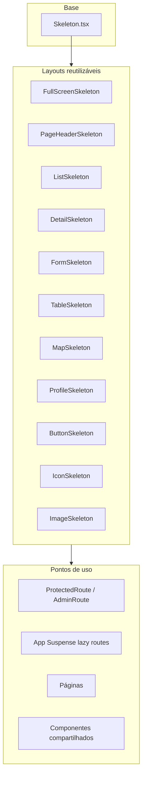

# Sistema de Skeleton Loading

Este documento descreve o padrão de carregamento da aplicação ISFIA após a migração de spinners (`Spinner`, `LoadingScreen`, `animate-spin`) para **skeletons** contextuais.

## Objetivo

- Mostrar placeholders que imitam o layout real da tela, em vez de indicadores genéricos de “carregando”.
- Manter consistência visual no tema escuro (`#000000` / `#1A1A1A`).
- Centralizar layouts reutilizáveis para novas telas e componentes.

## Arquitetura



## Componente base

**Arquivo:** `src/components/Skeleton.tsx`

Bloco retangular com `animate-pulse` e fundo `rgba(26, 26, 26, 0.8)`.

| Prop | Tipo | Descrição |
|------|------|-----------|
| `className` | `string` | Classes Tailwind (altura, largura, bordas) |
| `fullScreen` | `boolean` | Renderiza `FullScreenSkeleton` em tela cheia |
| `style` | `CSSProperties` | Estilos inline (ex.: círculo em `CircularMetric`) |

```tsx
import Skeleton from '../components/Skeleton';

// Bloco simples
<Skeleton className="h-16 w-full rounded-lg" />

// Tela cheia (Suspense, rotas protegidas)
<Skeleton fullScreen />
```

## Layouts reutilizáveis

**Pasta:** `src/components/skeletons/`  
**Export:** `src/components/skeletons/index.ts`

| Componente | Uso típico | Props principais |
|------------|------------|------------------|
| `FullScreenSkeleton` | Auth, licença, lazy routes, admin guard | `className?` |
| `PageHeaderSkeleton` | Barra sticky com título | — |
| `ListSkeleton` | Listas de equipamentos, planos, logs | `count`, `itemClassName` |
| `DetailSkeleton` | Detalhe de equipamento / reservatório | `rows`, `showInspections` |
| `FormSkeleton` | Formulários e campos dinâmicos | `fields`, `showSubmit` |
| `TableSkeleton` | Admin audit, licenças | `rows`, `columns` |
| `MapSkeleton` | Mapa de equipamentos | — |
| `ProfileSkeleton` | Tela de perfil | — |
| `ButtonSkeleton` | Texto dentro de botões em loading | `width`, `className` |
| `IconSkeleton` | Botões de ícone, sync, avatar | `className` |
| `ImageSkeleton` | Upload, câmera, imagem progressiva | `className`, `fullScreen` |

### Exemplos

```tsx
import {
  ListSkeleton,
  FormSkeleton,
  ButtonSkeleton,
  DetailSkeleton,
} from '../components/skeletons';

// Lista
if (loading) return <ListSkeleton count={5} itemClassName="h-24 w-full rounded-lg" />;

// Formulário
if (loadingData) return <FormSkeleton fields={6} />;

// Botão de ação
<button disabled={loading} aria-busy={loading}>
  {loading ? <ButtonSkeleton width="w-24" /> : t('common.save')}
</button>

// Detalhe
if (loading) return <DetailSkeleton rows={6} showInspections />;
```

## Onde está aplicado

### Infraestrutura de rotas

| Arquivo | Comportamento |
|---------|---------------|
| `src/App.tsx` | `PageSuspense` → `<Skeleton fullScreen />` |
| `src/components/ProtectedRoute.tsx` | Verificação auth/licença → `FullScreenSkeleton` |
| `src/components/AdminRoute.tsx` | Verificação admin → `FullScreenSkeleton` |

### Páginas

| Página | Layout |
|--------|--------|
| `Dashboard.tsx` | Skeleton no greeting + card de estatísticas |
| `Profile.tsx` | `ProfileSkeleton` + `IconSkeleton` no upload de avatar |
| `EquipmentListPage.tsx` | `ListSkeleton` |
| `History.tsx` | `ListSkeleton` |
| `ActionPlansPage.tsx` | `PageHeaderSkeleton` + filtros + `ListSkeleton` |
| `EquipmentDetailPage.tsx` | `DetailSkeleton` + `IconSkeleton` / `ButtonSkeleton` em PDF |
| `EquipmentMap.tsx` | `MapSkeleton` |
| `WaterReservoirDetailPage.tsx` | `DetailSkeleton` |
| `AddInspectionPage.tsx` | `FormSkeleton` + `ButtonSkeleton` no submit |
| `AddWaterReservoirPage.tsx` | `ButtonSkeleton` no submit |
| `AddWaterReservoirInspectionPage.tsx` | `FormSkeleton` + `ButtonSkeleton` |
| `AdminSecurityAuditPage.tsx` | `TableSkeleton` (global e por aba) |
| `LicenseManagement.tsx` | `FullScreenSkeleton` + `TableSkeleton` + `IconSkeleton` no refresh |
| `ActivateLicense.tsx` | `FormSkeleton` + `ButtonSkeleton` |
| `QrInspectionPage.tsx` | `ImageSkeleton` no scanner + `ButtonSkeleton` nos botões |
| `QrGeneratorPage.tsx` | `ButtonSkeleton` no download em lote |
| `AdminSystemSettingsPage.tsx` | `FormSkeleton` |
| `LogManagementPage.tsx` | `ListSkeleton` |
| `MyDataPage.tsx`, `EditEquipmentPage.tsx`, `AddEquipmentPage.tsx` | `ButtonSkeleton` nos submits |

### Componentes compartilhados

| Componente | Layout |
|------------|--------|
| `FileUpload.tsx`, `PhotoUpload.tsx` | `ImageSkeleton` durante compressão |
| `InlineCamera.tsx` | `ImageSkeleton fullScreen` ao iniciar câmera |
| `ProgressiveImage.tsx` | `ImageSkeleton` no placeholder |
| `CustomEquipmentForm.tsx` | `FormSkeleton` |
| `CustomChecklist.tsx` | `ListSkeleton` |
| `FeedbackModal.tsx`, `ConfirmationModal.tsx` | `ButtonSkeleton` no confirm/submit |
| `DashboardHeader.tsx`, `OfflineIndicator.tsx` | `IconSkeleton` durante sync |
| `ui/gaming-login.tsx` | `ButtonSkeleton` em todos os botões auth |
| `ui/map.tsx` | Grid skeleton no loader do mapa + `IconSkeleton` em “localizar” |
| `MetricCard.tsx`, `CircularMetric.tsx`, `AlertsList.tsx` | `Skeleton` inline (já existiam) |

## Padrões obrigatórios para código novo

### 1. Carregamento de página ou seção

Preferir um layout que espelhe a UI final (`ListSkeleton`, `DetailSkeleton`, etc.), não um spinner centralizado.

```tsx
if (loading) {
  return (
    <div className="min-h-screen" style={{ backgroundColor: '#000000' }}>
      <PageHeader title="..." />
      <main className="p-4">
        <ListSkeleton count={5} />
      </main>
    </div>
  );
}
```

### 2. Botões e ações inline

Manter o botão `disabled` e trocar o conteúdo por skeleton:

```tsx
<button disabled={loading} aria-busy={loading}>
  {loading ? <ButtonSkeleton width="w-20" /> : label}
</button>
```

Para ícones pequenos (PDF, refresh):

```tsx
{isBusy ? <IconSkeleton className="h-4 w-4" /> : <FileText size={16} />}
```

### 3. Overlays de mídia

Usar `ImageSkeleton` com `fullScreen` quando cobrir uma área (câmera, scanner QR):

```tsx
{loading && <ImageSkeleton fullScreen />}
```

### 4. Acessibilidade

Layouts de página e lista já incluem `aria-busy="true"` e `role="status"` onde aplicável. Em botões, usar `disabled` + `aria-busy={loading}`.

## Componentes legados (não usar)

Os arquivos abaixo **não são mais referenciados** pelo código ativo e podem ser removidos em limpeza futura:

- `src/components/LoadingScreen.tsx`
- `src/components/SplashScreen.tsx`
- `src/components/ui/spinner.tsx`

**Não** importar `Spinner`, `LoadingScreen` ou `SplashScreen` em código novo.

## Verificação

Para confirmar que não restou uso de spinners:

```bash
rg "Spinner|LoadingScreen|animate-spin|SplashScreen" src/
```

Build de produção:

```bash
npm run build
```

## Referências visuais

- Tema escuro: fundo `#000000`, blocos `#1A1A1A` / `rgba(26, 26, 26, 0.8)`
- Animação: `animate-pulse` (Tailwind)
- Referência de listas: `EquipmentListPage.tsx`, `History.tsx`
- Referência de detalhe: `EquipmentDetailPage.tsx`

## Histórico

- **2026-06:** Migração completa spinners → skeletons conforme plano `migrar_para_skeletons`.
- Escopo: páginas, rotas, botões de ação, uploads, câmera, modais e indicadores offline.
- Splash inicial: `FullScreenSkeleton` sem logo (placeholder 100%).
